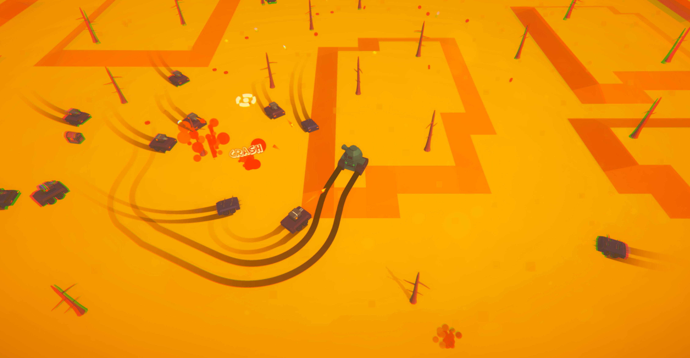

# Tankeo Drift

**Repository for my game Tankeo Drift**

---

## Overview

This game is a single player endless survival rouge-like. The player must battle endless waves of enemies while manouvering their tank and collecting coins to level up. 
The world is procedurally generated utilising a 3x3 grid that updates based on player position to make a seamless world. This game was built using **Unity** all models were created by myself in **Blender**.

---

## Features

- **Procedural World Generation**: Endless terrain generated by a 3x3 grid of world tiles that dynamically update based on player position.
- **Upgrade System**: Collecting experience allows players to level up their tank, with 4 main upgrade paths.
- **AI Variants**: The game features two AI's a ranged and melee vehicles that attack the player.


---


## Getting Started

To get the project up and running on your local machine, follow these steps:

***Option 1:***
1. **Clone the repository**:
   ```bash
   git clone https://github.com/Jake2508/Tank.git
   cd Tank
2. **Open Unity Hub**:
   ```bash
   Open the cloned repo
3. **Select Play**:

***Option 2:***
1. **Download the built game**:
   ```bash
   Go to - https://jake12341234.itch.io/tankeo-drift
   Select 'Download Now' 
2. **Extract the downloaded zip file**:
   ```bash
   Open the unzipped file
   Double-click the .exe file

## Built With
Unity - Game Engine

Blender - 3D Model Creations 

C# - Scripting & Programming 

## Author
***Jake Rose***

Website: [https://jake-rose.com/](https://jake-rose.com/)
